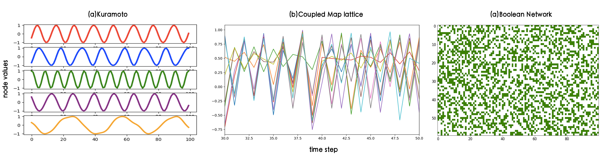

## A General Deep Learning Framework for Network Reconstruction

This repository will contain the official PyTorch implementation of:

**A General Deep Learning Framework for Network Reconstruction**

Zhang Zhang, Yi Zhao, Jing Liu, Shuo Wang, Ruyue Xin and Jiang Zhang\*(\*: Corresponding author)

The arxiv address will be made public at Tue, 5 Mar 2019.

 

**Abstract:** 

 
Recovering latent network structure and dynamics from observed time series data are important tasks in network science, and host a wealth of potential applications. In this work, we introduce Gumbel Graph Network (GGN), a model-free, data-driven deep learning framework to accomplish network reconstruction and dynamics simulation. Our model consists of two jointly trained parts: a network generator that generating a discrete network with the Gumbel Softmax technique; and a dynamics learner that utilizing the generated network and one-step trajectory value to predict the states in future steps. We evaluate GGN on Kuramoto, Coupled Map Lattice, and Boolean networks, which exhibit continuous, discrete, and binary dynamics, respectively. Our results show that GGN can be trained to accurately recover the network structure and predict future states regardless of the types of dynamics, and outperforms competing network reconstruction methods.

**Implementation Details**
Details of the implementation will be made public in a few days.